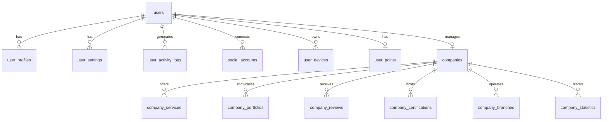
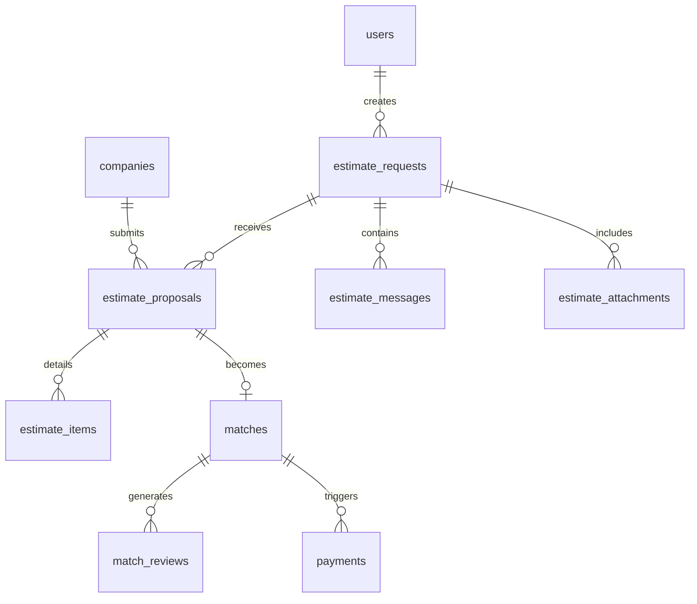
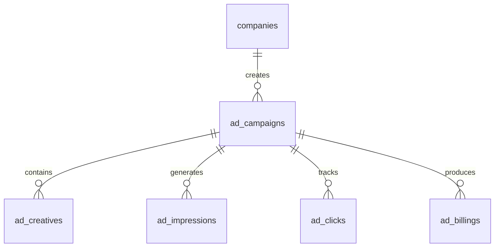
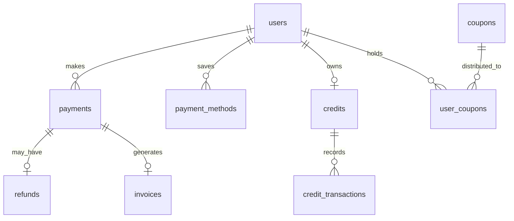

# Database Design Document

## 📋 프로젝트 개요

**프로젝트명**: Damoa (다모아)
**버전**: 1.0.0
**작성일**: 2025-10-31
**데이터베이스**: PostgreSQL 16 + Redis 7

### 시스템 목표
- 고객과 업체를 연결하는 중개 플랫폼
- 견적 요청/제안 시스템
- 업체 홍보 및 광고 시스템
- 향후 쇼핑몰 기능 확장 대비

---

## 🏗️ 데이터베이스 아키텍처

### 기술 스택
```
┌─────────────────────────────────────────┐
│            Application Layer            │
│         Spring Boot + JPA               │
└─────────────────────────────────────────┘
                    │
        ┌───────────┴───────────┐
        ▼                       ▼
┌──────────────┐       ┌──────────────┐
│ PostgreSQL   │       │    Redis     │
│   (영구)      │       │   (캐시)      │
└──────────────┘       └──────────────┘
```

### 데이터 분리 전략

| 데이터 유형 | PostgreSQL | Redis |
|------------|-----------|-------|
| 사용자 정보 | ✓ | - |
| 업체 정보 | ✓ | 캐시 |
| 견적/매칭 | ✓ | - |
| 결제 정보 | ✓ | - |
| 세션/토큰 | - | ✓ |
| OTP 코드 | - | ✓ |
| 임시 데이터 | - | ✓ |
| 실시간 알림 | - | ✓ |

---

## 📊 도메인 모델 관계도

### 1. 사용자-업체 관계


### 2. 견적-매칭 플로우


### 3. 광고 시스템


### 4. 결제 시스템


---

## 🔄 주요 비즈니스 플로우

### 1. 회원가입 플로우
```
1. 사용자 가입 요청
   ↓
2. Redis: 임시 데이터 저장 (10분 TTL)
   - 이메일 인증 코드
   - 가입 정보
   ↓
3. 이메일/SMS 인증
   ↓
4. PostgreSQL: users 테이블 생성
   ↓
5. PostgreSQL: user_profiles 생성
   ↓
6. Redis: 임시 데이터 삭제
```

### 2. 견적 요청-매칭 플로우
```
1. 고객: estimate_requests 생성
   ↓
2. 업체: estimate_proposals 제출
   ↓
3. 고객: 제안 검토
   ↓
4. 선택: matches 생성
   ↓
5. 작업 진행
   ↓
6. 완료: match_reviews 작성
```

### 3. 광고 집행 플로우
```
1. 업체: ad_campaigns 생성
   ↓
2. 관리자: 광고 승인
   ↓
3. 시스템: ad_impressions 기록
   ↓
4. 사용자: ad_clicks 발생
   ↓
5. 월말: ad_billings 정산
```

---

## 📁 테이블 상세 명세

### 핵심 테이블 설계

#### users 테이블
```sql
CREATE TABLE users (
    id BIGSERIAL PRIMARY KEY,           -- 내부 참조
    uuid UUID UNIQUE NOT NULL,           -- 외부 API
    email VARCHAR(255) UNIQUE NOT NULL,  -- 로그인 ID
    role user_role NOT NULL,             -- 역할
    -- 인증 상태
    email_verified BOOLEAN DEFAULT FALSE,
    phone_verified BOOLEAN DEFAULT FALSE,
    identity_verified BOOLEAN DEFAULT FALSE,
    -- 추적 정보
    last_login_at TIMESTAMP,
    login_count INT DEFAULT 0,
    -- Soft Delete
    is_deleted BOOLEAN DEFAULT FALSE,
    deleted_at TIMESTAMP,
    -- 확장
    metadata JSONB DEFAULT '{}'
);
```

**설계 포인트**:
- 인증 정보를 별도 테이블이 아닌 컬럼으로 관리 (조인 최소화)
- metadata JSONB로 확장성 확보
- Soft Delete 패턴 적용

#### companies 테이블
```sql
CREATE TABLE companies (
    id BIGSERIAL PRIMARY KEY,
    uuid UUID UNIQUE NOT NULL,
    user_id BIGINT REFERENCES users(id),
    -- 기본 정보
    name VARCHAR(200) NOT NULL,
    description TEXT,
    -- JSONB 활용
    business_info JSONB,      -- 사업자 정보
    business_hours JSONB,     -- 영업시간
    coordinates JSONB,        -- 위치 정보
    -- 배열 활용
    service_areas text[],     -- 서비스 지역
    tags text[],              -- 태그
    keywords text[],          -- 검색 키워드
    -- 통계
    avg_rating DECIMAL(3,2) DEFAULT 0,
    review_count INT DEFAULT 0
);
```

**설계 포인트**:
- 자주 함께 조회되는 정보를 한 테이블에 통합
- JSONB로 구조화된 복잡한 데이터 저장
- 배열로 다대다 관계 단순화

#### ad_campaigns 테이블 (통합 광고)
```sql
CREATE TABLE ad_campaigns (
    id BIGSERIAL PRIMARY KEY,
    uuid UUID UNIQUE NOT NULL,
    company_id BIGINT REFERENCES companies(id),
    -- 광고 타입별 통합 관리
    ad_type ad_type NOT NULL,  -- LISTING, AI_RECOMMENDATION, BANNER, POPUP
    ad_config JSONB,            -- 타입별 설정
    targeting JSONB,            -- 타겟팅 설정
    -- 예산
    budget_type VARCHAR(50),
    budget_amount DECIMAL(12,2),
    spent_amount DECIMAL(12,2) DEFAULT 0
);
```

**설계 포인트**:
- 4가지 광고 타입을 하나의 테이블로 통합
- ad_config JSONB로 타입별 특수 설정 처리
- targeting JSONB로 유연한 타겟 설정

#### boards 테이블 (통합 게시판)
```sql
CREATE TABLE boards (
    id BIGSERIAL PRIMARY KEY,
    uuid UUID UNIQUE NOT NULL,
    -- 게시판 타입
    board_type board_type NOT NULL,  -- NOTICE, EVENT, FAQ, GALLERY, DOCUMENT
    -- 기본 콘텐츠
    title VARCHAR(200) NOT NULL,
    content TEXT,
    -- 타입별 데이터
    type_data JSONB,  -- 이벤트 날짜, 갤러리 이미지 등
    -- 태그
    tags text[],
    -- 통계
    view_count INT DEFAULT 0,
    like_count INT DEFAULT 0
);
```

**설계 포인트**:
- 5가지 게시판 타입 통합 관리
- type_data JSONB로 타입별 특수 필드
- 코드 재사용성 극대화

---

## 🎯 JSONB 활용 전략

### 1. 구조화된 데이터 (business_info)
```json
{
    "registration_number": "123-45-67890",
    "ceo_name": "홍길동",
    "business_type": "서비스업",
    "business_item": "인테리어",
    "establishment_date": "2020-01-01",
    "employee_count": 10
}
```

### 2. 시간 데이터 (business_hours)
```json
{
    "mon": {"open": "09:00", "close": "18:00", "is_closed": false},
    "tue": {"open": "09:00", "close": "18:00", "is_closed": false},
    "wed": {"open": "09:00", "close": "18:00", "is_closed": false},
    "thu": {"open": "09:00", "close": "18:00", "is_closed": false},
    "fri": {"open": "09:00", "close": "18:00", "is_closed": false},
    "sat": {"open": "10:00", "close": "16:00", "is_closed": false},
    "sun": {"is_closed": true},
    "holiday_closed": true
}
```

### 3. 동적 설정 (ad_config)
```json
// LISTING 타입
{
    "bid_amount": 1000,
    "daily_budget": 50000,
    "position_boost": 1
}

// BANNER 타입
{
    "position": "MAIN_TOP",
    "size": "728x90",
    "image_url": "https://...",
    "link_url": "https://...",
    "alt_text": "광고 이미지"
}
```

### 4. 타겟팅 설정 (targeting)
```json
{
    "locations": ["서울", "경기", "인천"],
    "age_range": {"min": 25, "max": 45},
    "gender": "ALL",
    "interests": ["인테리어", "리모델링", "건축"],
    "devices": ["MOBILE", "PC"],
    "time_slots": ["09-12", "18-21"]
}
```

---

## 🔍 인덱스 설계

### 1. Primary & Unique 인덱스
- 모든 테이블: id (PRIMARY KEY)
- 모든 테이블: uuid (UNIQUE)
- users: email (UNIQUE)

### 2. Foreign Key 인덱스
- 자동 생성됨 (PostgreSQL)

### 3. 검색 최적화 인덱스

#### Full-text Search
```sql
CREATE INDEX idx_companies_search ON companies USING GIN(
    to_tsvector('simple',
        name || ' ' ||
        COALESCE(description, '') || ' ' ||
        array_to_string(tags, ' ')
    )
);
```

#### JSONB 인덱스
```sql
CREATE INDEX idx_companies_business_info ON companies USING GIN(business_info);
CREATE INDEX idx_ad_campaigns_targeting ON ad_campaigns USING GIN(targeting);
CREATE INDEX idx_boards_type_data ON boards USING GIN(type_data);
```

#### 배열 인덱스
```sql
CREATE INDEX idx_companies_tags ON companies USING GIN(tags);
CREATE INDEX idx_companies_service_areas ON companies USING GIN(service_areas);
CREATE INDEX idx_boards_tags ON boards USING GIN(tags);
```

#### 복합 인덱스
```sql
-- 자주 사용되는 쿼리 패턴 최적화
CREATE INDEX idx_estimate_requests_user_status
    ON estimate_requests(user_id, status, created_at DESC)
    WHERE is_deleted = FALSE;

CREATE INDEX idx_ad_campaigns_company_status
    ON ad_campaigns(company_id, status, ad_type)
    WHERE is_deleted = FALSE;
```

---

## 🚀 성능 최적화 전략

### 1. 쿼리 최적화

#### 페이지네이션
```sql
-- Offset 대신 Cursor 기반 페이지네이션
SELECT * FROM companies
WHERE id > :last_id
  AND is_deleted = FALSE
ORDER BY id
LIMIT 20;
```

#### 집계 쿼리
```sql
-- 실시간 집계 대신 사전 집계 테이블 활용
-- company_statistics 테이블에 일별/월별 집계
UPDATE company_statistics
SET profile_views = profile_views + 1
WHERE company_id = :id AND stat_date = CURRENT_DATE;
```

### 2. 캐싱 전략

| 데이터 | 캐시 TTL | 캐시 키 |
|--------|----------|---------|
| 업체 목록 | 5분 | company:list:{filter_hash} |
| 업체 상세 | 10분 | company:detail:{uuid} |
| 게시판 목록 | 1분 | board:{type}:list:{page} |
| 사용자 프로필 | 10분 | user:profile:{uuid} |
| 광고 목록 | 30초 | ad:active:list |

### 3. 데이터베이스 튜닝

#### PostgreSQL 설정
```conf
# postgresql.conf
shared_buffers = 4GB
effective_cache_size = 12GB
work_mem = 16MB
maintenance_work_mem = 512MB
random_page_cost = 1.1
effective_io_concurrency = 200
```

#### 파티셔닝
```sql
-- 로그 테이블 월별 파티셔닝
CREATE TABLE user_activity_logs_2025_01 PARTITION OF user_activity_logs
FOR VALUES FROM ('2025-01-01') TO ('2025-02-01');
```

---

## 📈 확장성 고려사항

### 1. 수평 확장 (Horizontal Scaling)
- Read Replica 구성 가능
- 샤딩 키: company_id, user_id
- 파티션 키: created_at

### 2. 수직 확장 (Vertical Scaling)
- JSONB 활용으로 스키마 변경 최소화
- 배열 타입으로 관계 테이블 감소
- metadata 필드로 확장 데이터 수용

### 3. 마이크로서비스 분리 대비
```
현재 (모놀리식):
┌──────────────────┐
│   Damoa App      │
│  (All Features)  │
└──────────────────┘

미래 (마이크로서비스):
┌─────────┐ ┌─────────┐ ┌─────────┐
│ User    │ │Company  │ │Payment  │
│Service  │ │Service  │ │Service  │
└─────────┘ └─────────┘ └─────────┘
     │           │           │
┌─────────────────────────────────┐
│       Shared Database           │
└─────────────────────────────────┘
```

---

## 🔒 보안 고려사항

### 1. 데이터 암호화
- 비밀번호: bcrypt 해싱
- 결제 정보: AES-256 암호화
- 개인정보: 별도 암호화 키 관리

### 2. 접근 제어
- Row Level Security (RLS) 적용 검토
- 역할 기반 접근 제어 (RBAC)
- API 레벨 권한 검증

### 3. 감사 로그
- audit_logs 테이블로 모든 중요 작업 추적
- 사용자 활동 로그 보관 (90일)
- 결제 로그 장기 보관 (5년)

---

## 🛠️ 개발 가이드라인

### 1. 네이밍 컨벤션
- 테이블: 복수형, snake_case (users, company_reviews)
- 컬럼: snake_case (created_at, is_deleted)
- 인덱스: idx_{table}_{columns}
- 제약조건: {table}_{column}_{type} (users_email_unique)

### 2. 데이터 타입 가이드
- ID: BIGSERIAL (8 bytes)
- UUID: UUID (16 bytes)
- 금액: DECIMAL(12,2)
- 비율: DECIMAL(5,2)
- 날짜시간: TIMESTAMP (UTC)
- Boolean: BOOLEAN (not TINYINT)

### 3. JSONB 사용 원칙
- 구조가 자주 변경되는 데이터
- 선택적 필드가 많은 데이터
- 타입별로 다른 구조를 가진 데이터
- 쿼리 성능이 중요하지 않은 메타데이터

### 4. 배열 사용 원칙
- 순서가 중요한 목록
- 단순한 값의 집합
- 다대다 관계 중 조인이 불필요한 경우
- GIN 인덱스로 검색 가능한 태그/키워드

---

## 📅 마이그레이션 전략

### Phase 1: 기본 구조 (현재)
- V1__Initial_schema.sql
- 55개 핵심 테이블
- 기본 기능 구현

### Phase 2: 쇼핑몰 확장
- V2__Add_shopping_mall.sql
- 13개 추가 테이블
- 상품, 주문, 배송 관리

### Phase 3: 고급 기능
- V3__Add_advanced_features.sql
- 실시간 채팅
- AI 추천 엔진
- 화상 상담

### Phase 4: 분석 강화
- V4__Add_analytics.sql
- 상세 분석 테이블
- 머신러닝 데이터 파이프라인

---

## 📚 참고 문서

- [PostgreSQL 16 Documentation](https://www.postgresql.org/docs/16/)
- [Redis 7 Documentation](https://redis.io/docs/)
- [Spring Data JPA Guide](https://spring.io/guides/gs/accessing-data-jpa/)
- [JSONB Performance Tips](https://www.postgresql.org/docs/current/datatype-json.html)

---

## 🔄 변경 이력

| 버전 | 날짜 | 변경 내용 | 작성자 |
|------|------|-----------|--------|
| 1.0.0 | 2025-10-31 | 초기 스키마 설계 (55개 테이블) | Claude |

---

## 📞 문의사항

데이터베이스 설계 관련 문의사항은 다음 채널을 통해 문의하세요:
- 프로젝트 관리자
- 기술 지원팀
- GitHub Issues